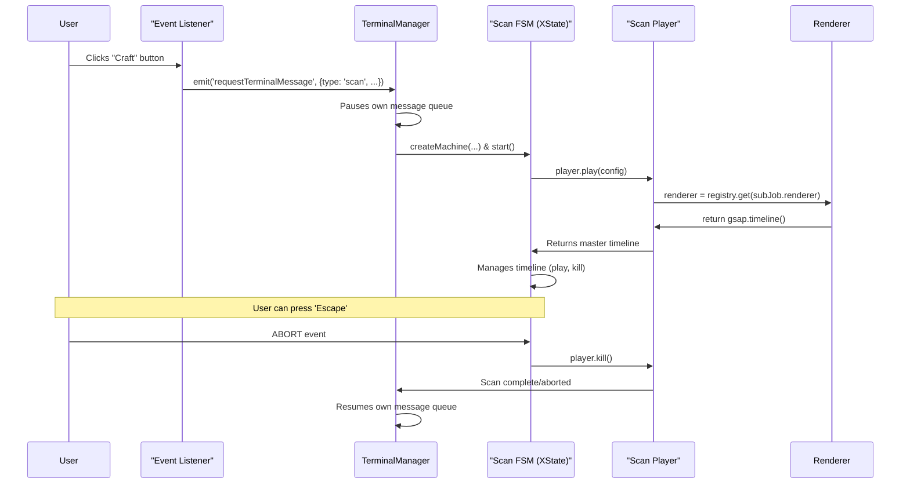

Of course. I have re-evaluated the plan, incorporating a deeper analysis of the provided project structure and CSS architecture. The goal is to ensure the proposed changes align perfectly with the existing, well-defined file organization and styling conventions.

Here is the fully updated, single-file specification.

***

### **HUE 9000: Scan Sequence V2 - Product & Technical Specification**

| **Version** | **Status**      | **Author** | **Stakeholders**                               |
| :---------- | :-------------- | :--------- | :--------------------------------------------- |
| 1.1         | **Revised**     | HUE 9000   | Product, Design, Engineering, Accessibility    |

### 1. File Manifest

This is the comprehensive list of files relevant to this initiative, organized by action and path, aligning with the `PROJECT STRUCTURE.md`.

#### **NEW FILES**

| Path                                    | Purpose                                                                                                 |
| :-------------------------------------- | :------------------------------------------------------------------------------------------------------ |
| `src/css/2-components/_scan-sequence.css` | **NEW:** A dedicated stylesheet for the scan sequence UI, including the "Type Window" renderer styles. |
| `src/js/renderers/barFill.js`             | Houses the logic for the existing bar-fill sub-job renderer.                                            |
| `src/js/renderers/index.js`               | Implements the Renderer Registry to manage different scan visualizations.                               |
| `src/js/renderers/typeWindow.js`          | Houses the logic for the new "Type Window" sub-job renderer.                                            |
| `src/js/scanFsm.js`                       | Defines the XState Finite State Machine for managing the scan lifecycle.                                |

#### **FILES TO MODIFY**

| Path                               | Change Summary                                                                                                 |
| :--------------------------------- | :------------------------------------------------------------------------------------------------------------- |
| `src/css/main.css`                 | Add `@import` for the new `_scan-sequence.css` file within the `components` layer.                               |
| `src/js/ScanSequencePlayer.js`     | Major refactor: Simplify from a monolithic timeline builder to a lean orchestrator that uses the Renderer Registry. |
| `src/js/TerminalManager.js`        | Major refactor: Becomes the orchestrator for scan sequences, handling a new `scan` message type and managing the lifecycle. |
| `src/js/config/scanSequences.js`   | Add a `renderer` key to sub-job configurations to specify which visualization to use.                            |
| `src/js/main.js`                   | Update the `buttonInteracted` event handler to send the new `scan` message type to the `TerminalManager`.          |
| `src/js/terminalMessages.js`       | Update the `getMessage` function for `type: 'scan'` to return a `scanConfig` object instead of DOM elements.       |

#### **FILES TO REVIEW (for context)**

| Path                               | Purpose of Review                                                                                              |
| :--------------------------------- | :------------------------------------------------------------------------------------------------------------- |
| `src/css/2-components/_terminal.css` | Understand existing terminal text and effect styling (`.terminal-line`, chromatic aberration).                   |
| `src/js/appState.js`               | Understand the central state management and event bus (`emit`, `subscribe`).                                   |
| `src/js/config/index.js`           | Review existing configuration constants that may be relevant (e.g., `HUE_ASSIGNMENT_ROW_HUES`).                |
| `src/js/serviceLocator.js`         | Understand how dependencies are managed and retrieved.                                                         |
| `src/js/startupMachine.js`         | Review the existing XState implementation for patterns and conventions.                                        |

### 2. Overview & Goals

#### 2.1. Problem Statement

The current "Skill Scan" and "Fit Eval" sequences are functional but lack the immersive quality and visual variety expected of a core HUE 9000 feature. The transition from the main terminal is visually jarring, the sub-job animations are repetitive, and the underlying architecture is rigid, making future enhancements difficult and risky.

#### 2.2. Vision

This initiative will transform the scan sequence into a **signature moment** of the HUE 9000 experience. The new version will be more immersive, visually diverse, and accessible, all supported by a robust and extensible architecture that ensures long-term maintainability.

#### 2.3. User Stories

| ID    | User Story                                                                                             |
| :---- | :----------------------------------------------------------------------------------------------------- |
| US-1  | **As a user,** I want the transition from the terminal to a scan to feel seamless and integrated.        |
| US-2  | **As a user,** I want to see varied and engaging animations during a scan to better understand the process. |
| US-3  | **As a developer,** I want an extensible system to easily add new scan visualizations in the future.       |
| US-4  | **As an accessibility advocate,** I want the scan to be understandable and comfortable for all users.    |

### 3. Functional Requirements

| ID   | Requirement                 | Description                                                                                                                                                                                                                                                         |
| :--- | :-------------------------- | :------------------------------------------------------------------------------------------------------------------------------------------------------------------------------------------------------------------------------------------------------------------ |
| FR-1 | **Seamless Screen Takeover**| The scan sequence will render *inside* the existing terminal's content area, inheriting its bezel and effects. This eliminates DOM replacement and creates an immersive, in-world transition.                                                                      |
| FR-2 | **Renderer Registry**       | A new architectural pattern will be implemented allowing different "renderers" (visualization types) to be registered and dynamically invoked based on the scan configuration, promoting modularity and extensibility.                                               |
| FR-3 | **New "Type Window" Renderer** | A new renderer will be created that displays a single-line text window. During the sub-job's execution, this window will cycle through pre-defined phrases with a "scramble" effect, accompanied by a subtle background pulse animation.                               |
| FR-4 | **State Machine Control**   | Each scan sequence **must** be managed by its own short-lived Finite State Machine (XState). This will provide robust, traceable control over the sequence's lifecycle: `intro` → `running` → `outro` → `completed` / `aborted`.                                     |
| FR-5 | **Desktop Interruptibility**| Desktop users **must** be able to abort a running scan sequence by pressing the `Escape` key. This will trigger the FSM to transition to an `aborted` state, cleanly kill the animation, and display a confirmation message in the terminal.                            |
| FR-6 | **Accessibility Compliance**  | All new animations **must** respect the `prefers-reduced-motion` media query. If detected, animations will be disabled, and all scan steps will resolve instantly to their final state. Implementation **must** use `gsap.matchMedia()`.                       |
| FR-7 | **DOM Performance Cap**     | All renderers **must** implement a DOM node cap (e.g., 50 lines) to prevent unbounded DOM growth and ensure performance does not degrade on potentially longer, future scan sequences.                                                                                 |

### 4. UX & Visual Design Specification

#### 4.1. The "Screen Takeover" Hand-off

This sequence ensures a fluid, cinematic transition from terminal interaction to the scan sequence.

*   **Trigger:** User clicks a scan-initiating button (e.g., "Craft", "Lead").
*   **Animation Flow (Total Duration: ~200ms):**
    1.  **(T+0ms):** The `TerminalManager` receives the `scan` message. Its message queue is paused. The terminal cursor immediately changes from its idle blink to the "thinking" spinner (`.is-thinking`).
    2.  **(T+50ms):** A fast, bright LCD refresh sweep animates top-to-bottom across the terminal. This will leverage the existing `#sweep-overlay` and its keyframes in `_lcd.css`.
    3.  **(T+150ms):** The existing terminal content (all `.terminal-line` elements) fades to 50% opacity over 50ms.
    4.  **(T+200ms):** The `ScanSequencePlayer` mounts its UI *inside* the terminal's content `div`, replacing the faded content. The scan's own intro animation begins.

#### 4.2. "Type Window" Renderer

This new renderer provides a more dynamic and text-focused visualization for sub-jobs.

*   **Layout:** A single `div.scan-progressive-line-container` containing a `span.scan-progressive-text` and a `div.scan-progressive-bar-wrapper` for the pulse effect. These classes will be defined in the new `_scan-sequence.css`.
*   **Animation:**
    *   **Text:** On activation, the `<span>`'s content cycles through the `progressiveLines` array from the config. Each phrase is displayed for a configurable duration (e.g., 800ms) before smoothly transitioning to the next using the GSAP `TextPlugin`'s scramble effect.
    *   **Background Pulse:** A subtle horizontal gradient pulses behind the text, implemented via a CSS animation on `background-position`.
    ```css
    /* In _scan-sequence.css */
    .type-window-pulse {
      background: linear-gradient(90deg, 
        transparent 0%, 
        oklch(0.8 0.1 var(--dynamic-lcd-hue) / 0.3) 50%, 
        transparent 100%
      );
      background-size: 200% 100%;
      animation: pulse-bg 2s ease-in-out infinite;
    }
    @keyframes pulse-bg {
      from { background-position: 100% 0; }
      to   { background-position: -100% 0; }
    }
    ```
*   **Color & Typography:** The pulse color and text color will inherit the `hue` defined for the sub-job in `scanSequences.js`, ensuring thematic consistency. Font styles will inherit from `.lcd-content-wrapper` defined in `_lcd.css`. The text itself will share the chromatic aberration `text-shadow` effect from `_terminal.css`.
*   **Exit State:** Upon completion, the pulse animation fades out, the text freezes on the final phrase, and the sub-job's main icon changes to `check_circle`.

#### 4.3. Interrupt Flow (`Escape` Key)

*   **User Action:** User presses the `Escape` key during a scan.
*   **System Response:**
    1.  The FSM transitions to the `aborted` state.
    2.  All running animations in the `ScanSequencePlayer` are immediately killed via `gsap.context().revert()`.
    3.  The scan UI is removed from the DOM.
    4.  The `TerminalManager` resumes control, clears its content, and types a new status message: `> EVALUATION ABORTED BY USER.`

#### 4.4. Accessibility (`prefers-reduced-motion`)

*   **Behavior:** When `prefers-reduced-motion: reduce` is active:
    *   The "Screen Takeover" hand-off is skipped.
    *   The scan UI appears instantly, fully rendered in its final state.
    *   The `aria-live` region will still announce "Evaluation started," "Evaluation complete," and the final conclusion, but without the intermediate sub-job announcements to prevent overwhelming the user.

### 5. Technical Architecture Specification

#### 5.1. System Flow Diagram



#### 5.2. `TerminalManager` as Orchestrator

The `TerminalManager` will be refactored to be the **sole owner** of its content area. It will gain the ability to process a new message of type `scan`.
*   When a `scan` message is received, the `_processQueue` method will pause and initiate the scan lifecycle.
*   It will instantiate and start the `ScanFSM`.
*   It will create the sandboxed `div` for the `ScanSequencePlayer` to render into.
*   It will listen for the player to finish (or be aborted) before resuming its own message queue.

#### 5.3. `ScanSequencePlayer` as Renderer

The `ScanSequencePlayer` will be simplified. Its only responsibilities are to:
*   Accept a configuration and a target DOM element.
*   Build a master GSAP timeline by invoking the correct renderers from the registry.
*   Expose `play()` and `kill()` methods that control this master timeline.

#### 5.4. Renderer Registry (`renderers/index.js`)

A new module will implement the registry pattern, decoupling the player from the implementations of individual visualizations. It will expose `register(id, func)` and `get(id)` methods. This makes adding new scan types (e.g., `radialGauge`) a matter of creating a new renderer file and registering it, with no changes to the player itself.

#### 5.5. State Management (`scanFsm.js`)

A dedicated XState machine will manage the scan lifecycle, providing clear, traceable states and handling the interrupt logic cleanly.
*   **States:** `idle`, `intro`, `running`, `outro`, `aborted`, `completed`.
*   **Context:** `subJobIndex`, `scanConfig`, `masterTimeline`.
*   **Actions:** On state entry/exit, the FSM will invoke methods on the `ScanSequencePlayer` (e.g., `play()`, `kill()`).

#### 5.6. Accessibility Implementation (`gsap.matchMedia()`)

The use of `gsap.matchMedia()` is **mandatory** for handling `prefers-reduced-motion`. This ensures a single, maintainable source of truth for animation variants.

```javascript
// Example implementation within a renderer
let mm = gsap.matchMedia();

mm.add("(prefers-reduced-motion: no-preference)", (context) => {
  // Create and return the full GSAP timeline here
  let tl = gsap.timeline();
  tl.to(...);
  return tl;
});

mm.add("(prefers-reduced-motion: reduce)", (context) => {
  // Create and return an "instant" timeline here
  let tl = gsap.timeline();
  tl.set(...); // Use .set() to apply final state instantly
  return tl;
});
```

### 6. Development Plan

| Sprint | Week | Days  | Key Deliverables & Focus                                                                                                                                                             |
| :----- | :--- | :---- | :----------------------------------------------------------------------------------------------------------------------------------------------------------------------------------- |
| **1**  | 1    | 1-3   | **Architecture Refactor:** Implement the Renderer Registry. Migrate existing bar-fill logic into `renderers/barFill.js`. Refactor `ScanSequencePlayer` and `TerminalManager` to use the new orchestration model. |
|        |      | 4-5   | **Core Feature:** Develop the "Type Window" renderer (`renderers/typeWindow.js`). Create and import the new `_scan-sequence.css` stylesheet for its visuals. Update `scanSequences.js` config. |
| **1**  | 2    | 6-8   | **UX Polish:** Implement the "Screen Takeover" hand-off animation. Refine timings and easing for a seamless feel.                                                                    |
|        |      | 9-10  | **Robustness:** Implement the `scanFsm.js` state machine to control the sequence lifecycle. Integrate with `TerminalManager`.                                                        |
| **2**  | 3    | 11-13 | **Interrupt & Accessibility:** Wire up the `Escape` key to the FSM's `ABORT` event. Implement `prefers-reduced-motion` support using `gsap.matchMedia()` across all renderers.           |
|        |      | 14-15 | **QA & Bug Fixing:** Cross-browser testing (Chrome, Firefox, Safari). Performance profiling on desktop and mobile. Address any identified jank or state-related bugs.                  |
| **2**  | 4    | 16-17 | **Final Polish & Code Review:** Clean up code, add JSDoc comments to public APIs, and conduct a final peer review of the entire feature architecture.                                    |
|        |      | 18-20 | **Buffer & Documentation:** Contingency time. Update internal documentation to reflect the new architecture. Merge to main.                                                          |

### 7. Open Questions & Future Considerations

*   **Mobile Experience:** Per stakeholder feedback, an on-screen abort button will be **excluded** from this version to maintain a clean UI. This is a known UX trade-off.
*   **Future Renderers:** The new architecture is designed to easily accommodate new renderers. V3 could introduce more complex visualizations like radial gauges or sparkline graphs without requiring a core refactor.
*   **DOM Virtualization:** The DOM Cap (FR-7) is a pragmatic V2 solution. If future requirements call for significantly longer scan sequences (>50-100 lines), a more advanced DOM virtualization strategy should be investigated.